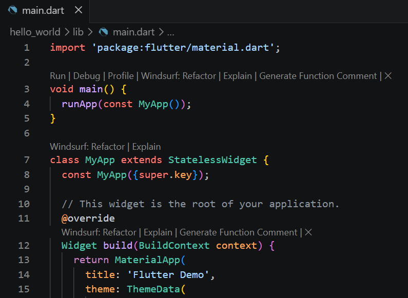
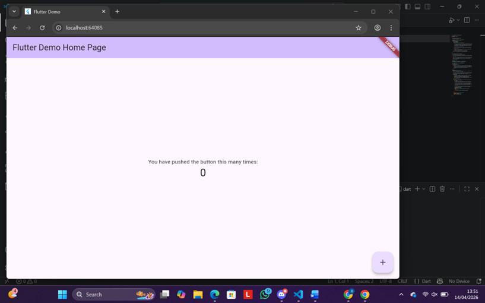
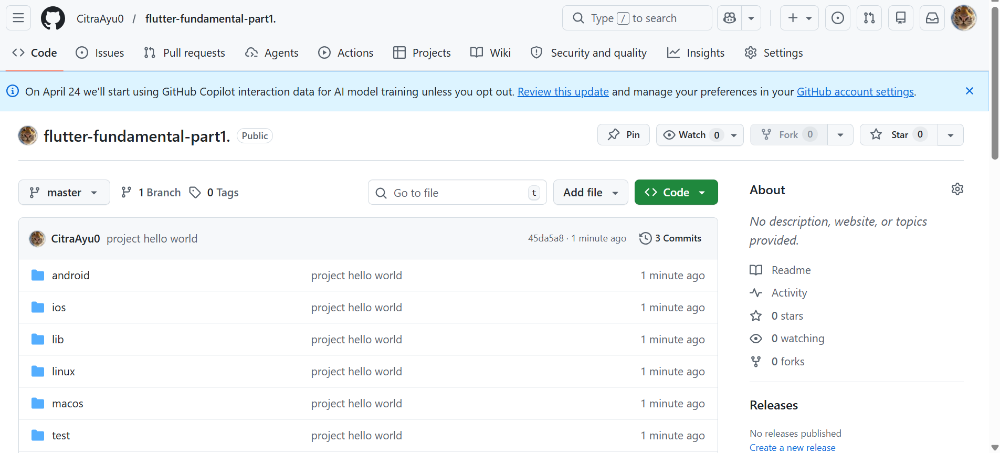
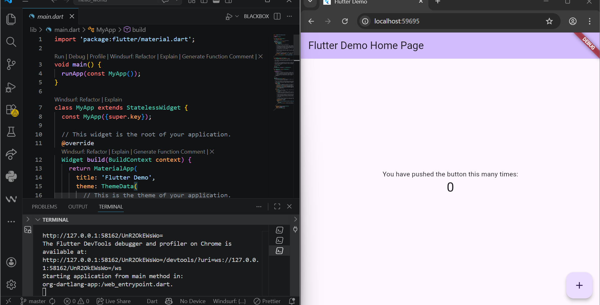
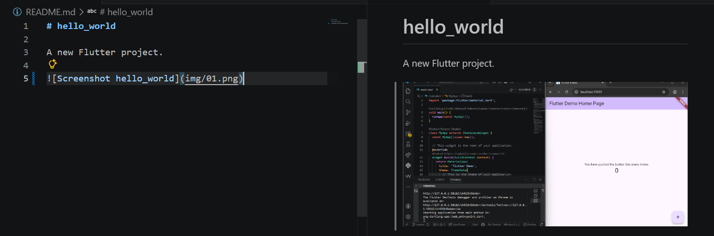
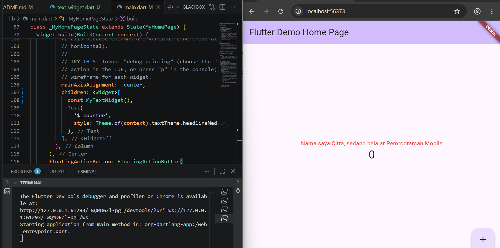
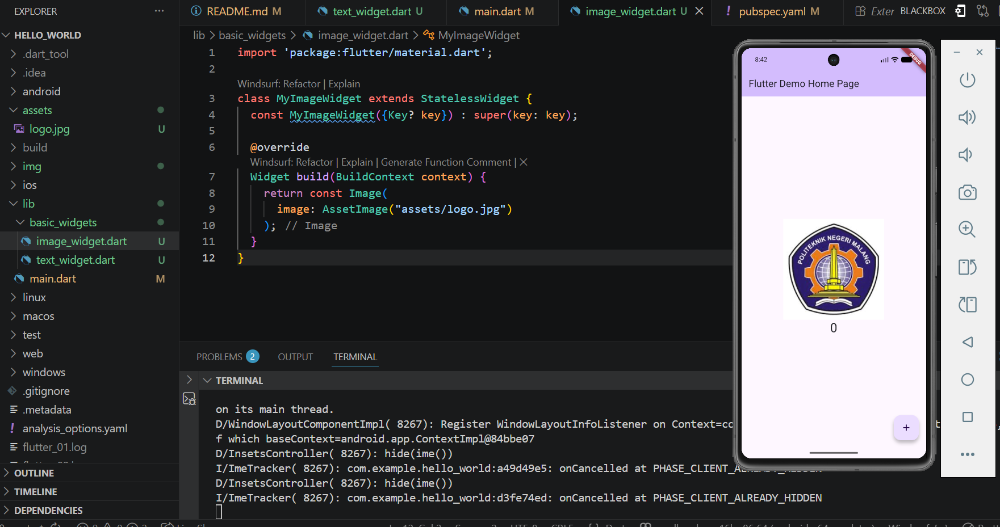
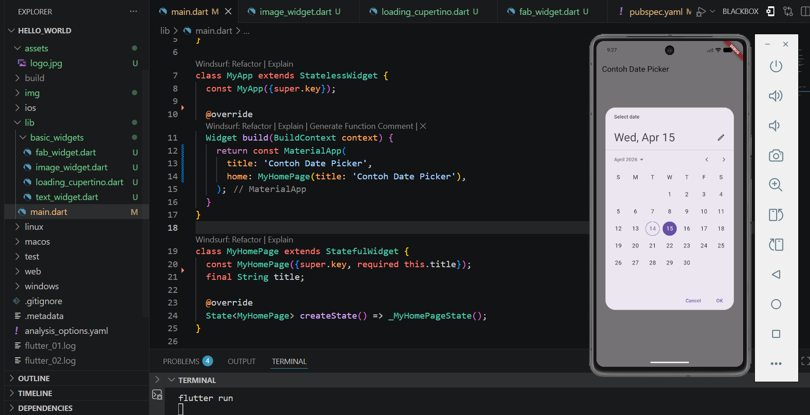

# PEMROGRAMAN MOBILE
## Jobsheet 4 – Flutter 1

**Nama** :Citra Ayu Meilinda  
**NIM** : 244107060015  
**Kelas** : SIB - 2F  

# Praktikum 1: Membuat Project Flutter Baru

Pada praktikum ini dilakukan pembuatan project Flutter baru menggunakan perintah flutter create melalui terminal. Project yang dibuat diberi nama hello_world sebagai langkah awal dalam membangun aplikasi mobile dengan framework Flutter.

# Praktikum 2: Menghubungkan Perangkat Android atau Emulator

Praktikum ini bertujuan untuk menghubungkan perangkat Android fisik atau emulator ke lingkungan pengembangan Flutter. Koneksi perangkat diperlukan agar project yang telah dibuat dapat dijalankan dan diuji secara langsung.

# Praktikum 3: Membuat Repository GitHub dan Laporan Praktikum

Pada praktikum ini dibuat repository baru di GitHub sebagai tempat penyimpanan kode project secara online. Selain itu, project hello_world berhasil dijalankan (run) dan hasilnya ditampilkan pada perangkat/emulator yang telah terhubung sebelumnya.

#### Membuat repository 

#### Proses run project hello_world

# Praktikum 4: Menerapkan Widget Dasar

Praktikum ini membahas penggunaan widget dasar pada Flutter, yaitu Text Widget dan Image Widget. Text Widget digunakan untuk menampilkan teks di layar, sedangkan Image Widget digunakan untuk menampilkan gambar dalam antarmuka aplikasi.

#### Text Widget

#### Image Widget

---

# Praktikum 5: Widget Material Design & Cupertino

Pada praktikum ini diterapkan widget dari dua library desain utama Flutter, yaitu Material Design (untuk Android) dan Cupertino (untuk iOS). Penggunaan kedua jenis widget ini memungkinkan tampilan aplikasi menyesuaikan gaya antarmuka sesuai platform yang digunakan.

